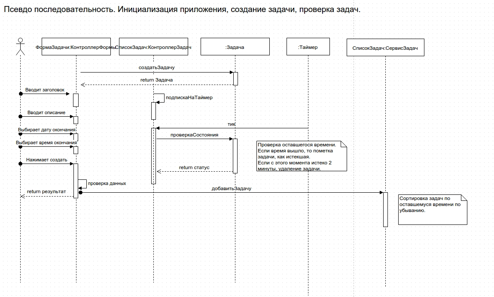
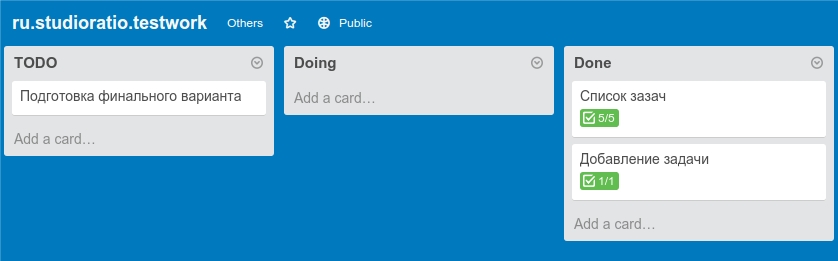

# Тестовое задание для ru.studioratio
## [Рабочая версия](http://pashaigood.github.io/ru.studioratio.testwork/)
### С чего я начал
* Создал псевдо диаграмму

* Накидал задачки 

* Запустил свой любимы yeoman генератор `yo gulp-angular`.
* Создал репо.
* Запустил сервер разработки `gulp serve`.
* Начал кодить!

### Процесс
* Самый надуманный момент - разделение на дату и время. Тут можно было подойти 2 путями:
  * Простой: Использовать два поля, ссылающееся на одну модель, то, что и выбрал.
  * Сложнее: Использовать 2 модели, в дальнейшем сшивать в одну дату.
* Локальное хранилище, гораздо проще использовать готовое решение, собственно выбрал то, чем всегда пользуюсь [ngStorage](https://github.com/gsklee/ngStorage).
* Форматирование времени. Тут я воспользовался своими наработками, когда-то на хакатончике уже решал подобную задачу.

### TODO. Что бы я улучшил
* Запрет добавления задач, время которых меньше текущего.
* Отключить не нужные стили из bootstrap.
* Покрыть тестами.